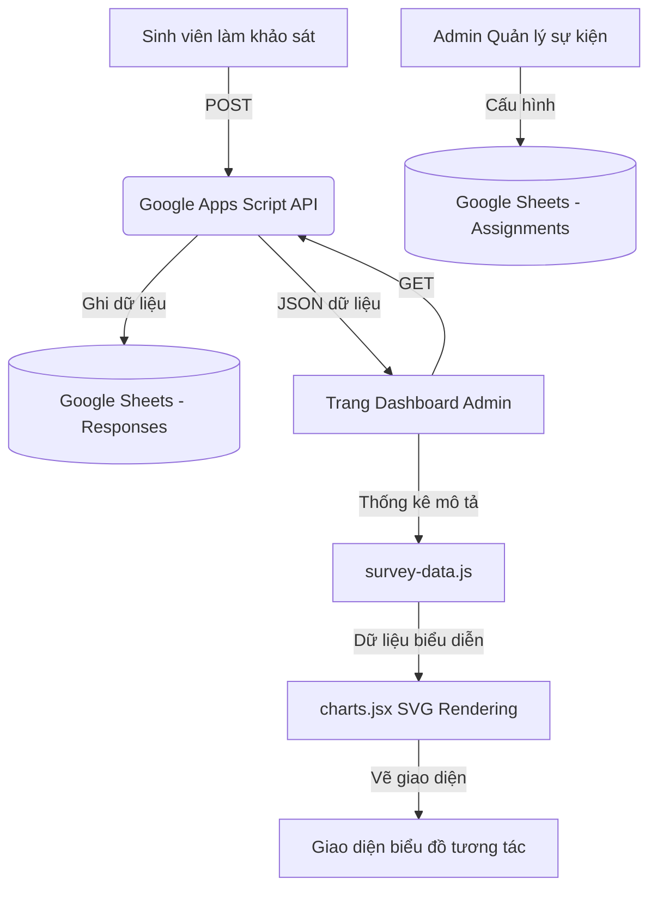

# Phương Pháp Thống Kê Mô Tả & Thuật Toán Vẽ Biểu Đồ
## Hệ thống Khảo sát & Đánh giá Hoạt động UEH (UEH Survey System)

Tài liệu này trình bày chi tiết về kiến trúc dữ liệu, các công thức toán học/thống kê mô tả và các thuật toán dựng hình vector (SVG) được áp dụng trong **Hệ thống Khảo sát & Đánh giá Hoạt động UEH** để tạo ra các biểu đồ trực quan hóa dữ liệu.

---

## 1. Kiến Trúc & Luồng Dữ Liệu (Data Pipeline)

Hệ thống được thiết kế theo mô hình **Serverless** gọn nhẹ nhằm tối ưu hóa chi phí vận hành và tốc độ tải trang:



1. **Nguồn dữ liệu (Google Sheets)**:
   * **Sheet `Assignments`**: Lưu thông tin cấu hình chương trình (quy mô, số lượng tham gia thực tế, đơn vị tổ chức, ngày bắt đầu/kết thúc khảo sát).
   * **Sheet `Responses`**: Lưu trữ các phiếu khảo sát hợp lệ. Mỗi phiếu gồm thông tin định danh (email, khóa, khoa, giới tính), điểm đánh giá 21 biến quan sát Likert (từ 1 đến 7), điểm đánh giá tổng thể (`overall`) và ý kiến định tính.
2. **API trung gian (Google Apps Script - `ueh-apps-script.gs`)**:
   * Đóng vai trò là Web App API. Hàm `handleGetResponses()` đọc dữ liệu từ Sheets, chuẩn hóa định dạng (chuyển chuỗi điểm thành số thực, định dạng ngày tháng) và trả về định dạng JSON.
3. **Frontend (React Client - `app.jsx`)**:
   * Thực hiện gọi API bất đồng bộ để kéo toàn bộ dữ liệu về lưu vào bộ nhớ cục bộ (`window.SURVEY_RESPONSES`), lọc dữ liệu thời gian thực theo bộ lọc sidebar (Chương trình) và bộ lọc nhân khẩu học (Khóa, Khoa), sau đó đưa qua các bộ tính toán thống kê mô tả để đưa vào các component vẽ biểu đồ.

---

## 2. Phương Pháp Thống Kê Mô Tả (Descriptive Statistics)

Các phương pháp thống kê mô tả được định nghĩa trong `survey-data.js` và `sections.jsx` nhằm biến đổi dữ liệu thô từ các phiếu khảo sát thành các chỉ số cô đọng.

### 2.1. Lọc và Làm Sạch Dữ Liệu (Data Cleaning & Filtering)
Trước khi tính toán, hệ thống chỉ giữ lại các phiếu khảo sát hợp lệ bằng cách kiểm tra địa chỉ email chứa ký tự `@`. Hệ thống hỗ trợ lọc đa chiều:
* **Lọc theo tập hợp chương trình**: Sử dụng cấu trúc dữ liệu `Set` để kiểm tra nhanh một phản hồi có nằm trong các chương trình được chọn hay không.
  
  **R<sub>filtered</sub> = { r ∈ R<sub>all</sub> | r.program ∈ S<sub>selected</sub> }**

* **Lọc theo Khoa và Khóa**: Lọc trực tiếp trên tập hợp phản hồi đã chọn bằng cách so khớp chuỗi ký tự khoa/khóa đã cấu hình.

---

### 2.2. Điểm Trung Bình Biến Quan Sát (Item Mean)
Điểm trung bình của một biến quan sát *j* (ví dụ: `CLCT1`) trên tập hợp phiếu khảo sát *R* được tính bằng công thức trung bình cộng số học đơn giản:

> **X̄<sub>j</sub> = (1 / N<sub>j</sub>) × Σ X<sub>r, j</sub>**

*Trong đó:*
* **R<sub>j</sub>** là tập hợp các phản hồi có điểm số hợp lệ cho biến quan sát *j*.
* **N<sub>j</sub>** là số lượng phản hồi hợp lệ cho biến quan sát *j* (N<sub>j</sub> = |R<sub>j</sub>|).
* **X<sub>r, j</sub>** là điểm số (từ 1 đến 7) mà sinh viên *r* đánh giá cho biến *j*.
* **Σ** là ký hiệu tổng của toàn bộ giá trị đánh giá từ sinh viên *r* thuộc tập hợp R<sub>j</sub>.

*Cài đặt mã nguồn (`survey-data.js`):*
```javascript
window.itemMean = function(rs, code) {
  return mean(rs.map(r => r[code]).filter(v => typeof v === "number"));
};
```

---

### 2.3. Điểm Trung Bình Nhân Tố (Factor Mean)
Mỗi nhân tố chính (ví dụ: `CLCT` - Chất lượng chương trình) được cấu thành bởi nhiều biến quan sát thành phần. Điểm trung bình của nhân tố *F* được tính bằng cách lấy trung bình gộp (pooled mean) của tất cả các điểm số thuộc các biến thành phần của nhân tố đó trên toàn bộ tập phiếu khảo sát *R*:

> **X̄<sub>F</sub> = (Σ<sub>j ∈ F</sub> Σ<sub>r ∈ R<sub>j</sub></sub> X<sub>r, j</sub>) / Σ<sub>j ∈ F</sub> N<sub>j</sub>**
>
> *(Hoặc viết đơn giản: X̄<sub>F</sub> = Tổng toàn bộ điểm các biến thuộc F / Tổng số lượt đánh giá)*

*Cài đặt mã nguồn (`survey-data.js`):*
```javascript
window.factorMean = function(rs, factor) {
  const vals = [];
  for (const r of rs) {
    for (const it of factor.items) {
      if (typeof r[it.code] === "number") vals.push(r[it.code]);
    }
  }
  return mean(vals);
};
```

---

### 2.4. Phân Phối Tần Số Phản Hồi (Response Distribution)
Để biết được số lượng sinh viên chọn từng mức độ đánh giá từ 1 đến 7 cho một biến quan sát *j*, hệ thống đếm tần số xuất hiện của các điểm số:

> **D<sub>j</sub> = [f<sub>1</sub>, f<sub>2</sub>, f<sub>3</sub>, f<sub>4</sub>, f<sub>5</sub>, f<sub>6</sub>, f<sub>7</sub>]**

Với **f<sub>k</sub>** là số lượng phiếu khảo sát có mức đánh giá X<sub>r, j</sub> = k (với k ∈ {1, 2, 3, 4, 5, 6, 7}).

---

### 2.5. Tỷ Lệ Hài Lòng (Satisfaction Rate)
Một phản hồi được coi là "Hài lòng" đối với hoạt động nếu điểm đánh giá trung bình của nhân tố Sự hài lòng (`SHL` gồm 3 biến quan sát: `SHL1`, `SHL2`, `SHL3`) đạt từ mức 5.0 trở lên (thang điểm 7):

> **Hài Lòng(r) = True ⟺ (X<sub>r, SHL1</sub> + X<sub>r, SHL2</sub> + X<sub>r, SHL3</sub>) / 3 ≥ 5.0**

Tỷ lệ hài lòng tổng thể được tính bằng:
> **Tỷ lệ Hài Lòng = (Số phiếu Hài Lòng / Tổng số phiếu) × 100%**

---

### 2.6. Thống Kê Nhân Khẩu Học (Demographic Breakdown)
* **Tỷ lệ Giới tính**: Đếm tần suất xuất hiện của giá trị `Nam` và `Nữ` trong tập dữ liệu.
* **Cơ cấu theo Khoa/Khóa**: Đếm tổng số sinh viên tham gia thực hiện khảo sát ứng với từng Khoa đào tạo và Khóa học nhằm xác định thành phần đối tượng tham gia chương trình nhiều nhất.

---

## 3. Thuật Toán Vẽ Biểu Đồ Bằng SVG Nguyên Bản (Native SVG Chart Rendering)

Ứng dụng không sử dụng thư viện đồ họa nặng nề mà trực tiếp dựng các phần tử hình ảnh thông qua cú pháp **SVG (Scalable Vector Graphics)** trong `charts.jsx`. Điều này đảm bảo hiệu năng tải trang nhanh vượt trội và khả năng tùy biến giao diện cao.

### 3.1. Biểu Đồ Tròn Khuyết (Donut Chart)
Được sử dụng để hiển thị tỷ lệ giới tính (Nam/Nữ) tham gia hoạt động.

* **Tính toán thông số**:
  - Bán kính đường tròn trung bình: **R = (size / 2) - (thickness / 2)**
  - Tọa độ tâm: **(Cx, Cy) = (size / 2, size / 2)**
  - Tỉ lệ tích lũy của từng phần được chuẩn hóa về đoạn [0, 1].
* **Thuật toán tạo đường dẫn cung tròn (`arcPath`)**:
  Để vẽ một cung tròn từ tỉ lệ bắt đầu `start` đến tỉ lệ kết thúc `end`, ta tính góc bắt đầu θ<sub>0</sub> và góc kết thúc θ<sub>1</sub> (trừ đi π/2 để biểu đồ bắt đầu quay từ đỉnh 12 giờ):
  > **θ<sub>0</sub> = start × 2π - π/2**
  > **θ<sub>1</sub> = end × 2π - π/2**
  
  Tọa độ điểm đầu (x<sub>0</sub>, y<sub>0</sub>) và điểm cuối (x<sub>1</sub>, y<sub>1</sub>) của cung tròn trên viền ngoài:
  > **x<sub>0</sub> = Cx + R × cos(θ<sub>0</sub>)**
  > **y<sub>0</sub> = Cy + R × sin(θ<sub>0</sub>)**
  > **x<sub>1</sub> = Cx + R × cos(θ<sub>1</sub>)**
  > **y<sub>1</sub> = Cy + R × sin(θ<sub>1</sub>)**
  
  Tham số `large-arc-flag` xác định hướng đi của cung tròn ngắn hay dài (bằng 1 nếu cung tròn có độ dài > 180° tức end - start > 0.5, ngược lại bằng 0).
  Đường dẫn SVG được định nghĩa dưới dạng chuỗi vẽ:
  > **d = "M " + x<sub>0</sub> + " " + y<sub>0</sub> + " A " + R + " " + R + " 0 " + largeArcFlag + " 1 " + x<sub>1</sub> + " " + y<sub>1</sub>**

---

### 3.2. Biểu Đồ Cột Ngang (HBarChart) & Cột Dọc (VBarChart)
Dùng để so sánh điểm trung bình của các biến quan sát hoặc so sánh điểm giữa các nhân tố chính.

* **Ánh xạ giá trị sang Pixel**:
  Vì điểm đánh giá nằm trong thang từ 1 đến 7, ta cần chuẩn hóa điểm số *V* (thuộc [1, 7]) về đoạn tỉ lệ phần trăm [0, 1] để tính toán chiều rộng/chiều cao trên màn hình:
  > **Ratio = (V - 1) / 6**
* **Tính toán kích thước cột ngang**:
  > **Width<sub>bar</sub> = Ratio × InnerWidth**
  
  Vẽ một thanh chữ nhật màu nền nhạt làm mốc tối đa 7 điểm và đè lên trên một thanh `<rect>` có chiều rộng Width<sub>bar</sub> mang màu sắc đại diện cho mức điểm.

---

### 3.3. Biểu Đồ Đường Mượt (Line Chart) với thuật toán Monotone Cubic Interpolation
Dùng để hiển thị đường phân phối phản hồi từ điểm 1 đến điểm 7 của các biến quan sát.

Nếu sử dụng đường nối thẳng (Linear) thì biểu đồ bị gãy khúc. Nếu sử dụng các thuật toán nội suy spline thông thường (như Hermite hay Catmull-Rom), đường cong có nguy cơ bị dội ngược (overshoot) tạo ra các điểm nhô lên cao hơn giá trị cực đại hoặc thấp hơn giá trị cực tiểu thực tế của dữ liệu. Do đó, hệ thống áp dụng **Phương pháp nội suy Monotone Cubic (Fritsch-Carlson)**:

```
[Điểm dữ liệu] ──> Tính độ dốc (d) ──> Giới hạn tiếp tuyến (m) để chống overshoot ──> Vẽ đường cong Bezier
```

* **Các bước thuật toán**:
  1. **Tính độ dốc giữa các cặp điểm liên tiếp**:
     > **d<sub>i</sub> = (y<sub>i+1</sub> - y<sub>i</sub>) / (x<sub>i+1</sub> - x<sub>i</sub>)** (với i = 0, ..., n-2)
  2. **Tính toán tiếp tuyến ban đầu tại mỗi nút m<sub>i</sub>**:
     Tại các điểm biên: m<sub>0</sub> = d<sub>0</sub>, m<sub>n-1</sub> = d<sub>n-2</sub>.
     Tại các nút trung gian: Lấy trung bình cộng của độ dốc hai bên liền kề nếu chúng cùng dấu, ngược lại đặt bằng 0:
     > **m<sub>i</sub> = (d<sub>i-1</sub> + d<sub>i</sub>) / 2** (nếu d<sub>i-1</sub> × d<sub>i</sub> > 0, ngược lại đặt bằng 0)
  3. **Hiệu chỉnh chống vượt ngưỡng (Fritsch-Carlson)**:
     Với mỗi đoạn [i, i+1], nếu d<sub>i</sub> = 0 thì đặt m<sub>i</sub> = m<sub>i+1</sub> = 0.
     Nếu không, ta tính hai hệ số tỉ lệ: α<sub>i</sub> = m<sub>i</sub> / d<sub>i</sub> và β<sub>i</sub> = m<sub>i+1</sub> / d<sub>i</sub>.
     Nếu α<sub>i</sub><sup>2</sup> + β<sub>i</sub><sup>2</sup> > 9, ta hiệu chỉnh lại các tiếp tuyến để đảm bảo tính đơn điệu (chống overshoot):
     > **τ<sub>i</sub> = 3 / √(α<sub>i</sub><sup>2</sup> + β<sub>i</sub><sup>2</sup>)**
     > **m<sub>i</sub> = τ<sub>i</sub> × α<sub>i</sub> × d<sub>i</sub>**
     > **m<sub>i+1</sub> = τ<sub>i</sub> × β<sub>i</sub> × d<sub>i</sub>**
  4. **Tạo chuỗi lệnh Cubic Bezier**:
     Khoảng cách điều khiển dọc theo trục X là Δx = (x<sub>i+1</sub> - x<sub>i</sub>) / 3.
     Điểm điều khiển thứ nhất: **(cp<sub>1x</sub>, cp<sub>1y</sub>) = (x<sub>i</sub> + Δx, y<sub>i</sub> + m<sub>i</sub> × Δx)**
     Điểm điều khiển thứ hai: **(cp<sub>2x</sub>, cp<sub>2y</sub>) = (x<sub>i+1</sub> - Δx, y<sub>i+1</sub> - m<sub>i+1</sub> × Δx)**
     Đường cong được nối bằng lệnh `C` của SVG: `C cp1x cp1y, cp2x cp2y, x_next y_next`.

---

### 3.4. Biểu Đồ Mạng Nhện (Radar Chart)
Được sử dụng để vẽ bức tranh toàn cảnh điểm trung bình của cả 6 nhân tố trên cùng một hệ trục.

* **Tính toán thông số**:
  - Điểm gốc tâm biểu đồ: **(Cx, Cy) = (size / 2, size / 2)**
  - Bán kính tối đa của trục mạng nhện: **R<sub>max</sub> = size / 2 - 44**
  - Tổng số trục (nhân tố): **n = 6**
* **Chuyển đổi sang hệ tọa độ phẳng (Cartesian)**:
  Để tính tọa độ điểm biểu diễn của nhân tố thứ *i* (có giá trị trung bình chuẩn hóa norm ∈ [0, 1] tương ứng thang điểm từ 1 đến 7), ta cần tính góc quay tương ứng θ<sub>i</sub>:
  > **θ<sub>i</sub> = (i / n) × 2π - π/2**
  
  Tọa độ (x<sub>i</sub>, y<sub>i</sub>) của đỉnh trên biểu đồ radar là:
  > **x<sub>i</sub> = Cx + R<sub>max</sub> × norm × cos(θ<sub>i</sub>)**
  > **y<sub>i</sub> = Cy + R<sub>max</sub> × norm × sin(θ<sub>i</sub>)**
* **Vẽ đa giác liên kết**:
  Nối chuỗi tọa độ (x<sub>0</sub>, y<sub>0</sub>), (x<sub>1</sub>, y<sub>1</sub>), ..., (x<sub>5</sub>, y<sub>5</sub>) thành một đa giác bằng thẻ `<polygon>` trong SVG với thuộc tính tô nền trong suốt `fillOpacity="0.15"` để người xem dễ dàng quan sát lưới tọa độ bên dưới.

---

## 4. Kết Luận

Hệ thống khảo sát đã vận dụng linh hoạt các công thức thống kê mô tả cơ bản kết hợp cùng giải thuật đồ họa hình học phẳng nhằm tối ưu hóa hiển thị dữ liệu trực quan:
* Đảm bảo tính trung thực dữ liệu, loại bỏ hoàn toàn các lỗi hiển thị dội ngược (overshoot) nhờ thuật toán **nội suy Monotone Cubic**.
* Tự động hóa hoàn toàn quy trình xử lý từ dữ liệu điền khảo sát của sinh viên thành các phân tích điểm mạnh, điểm yếu cho ban tổ chức.
* Tránh phụ thuộc các thư viện đồ họa nặng nề từ bên thứ ba, tăng tốc độ phản hồi của trang web lên mức tối đa.
